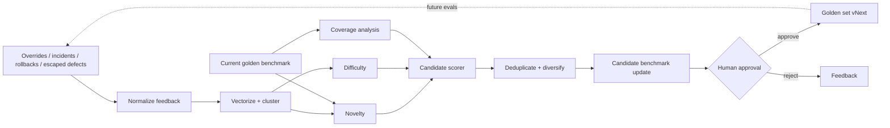

# GoldenSet Factory

**Production-feedback-to-benchmark lifecycle engineering for security and agent evaluations.**

<p align="center"></p>

GoldenSet Factory focuses on the data lifecycle behind a trustworthy evaluation program:

> **Which production failures, overrides, incidents, rollbacks, escaped defects, and edge cases should become tomorrow's benchmark?**

It does not evaluate an agent directly. It builds the machinery that **keeps the benchmark representative**.

## What it demonstrates

- Synthetic production-style feedback ingestion
- TF-IDF representation of failure summaries
- KMeans failure-pattern clustering
- PCA visualization for investigation
- Novelty scoring against an existing benchmark
- Difficulty scoring from novelty, severity, source, and recovery
- Benchmark coverage-ratio analysis by failure mode
- Deduplication and coverage-gap bonuses
- Version manifest generation
- Explicit human approval before benchmark promotion
- Apple-inspired Streamlit dashboard with 20 KPIs
- CLI, tests, Docker, and CI

## Architecture



## Coverage model

The factory compares the share of each failure mode in the current benchmark with the share observed in production-style feedback.

A mode becomes **underrepresented** when benchmark coverage falls well below its observed feedback share. Candidate selection then gives that gap an explicit bonus while preserving broad mode representation.

## Run

```bash
pip install -r requirements.txt
python engine.py --out artifacts --feedback 2500 --target 120
streamlit run app.py
```

## Responsible interpretation

All feedback, incidents, rollbacks, and benchmark cases are synthetic. Clustering and novelty are triage signals. They do not replace expert review, and auto-promotion is intentionally disabled.

---
**Production failure becomes benchmark evidence—only after review.**
