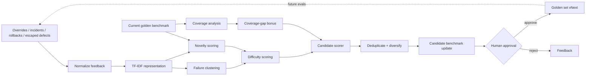

<div align="center">

# GoldenSet Factory

### Turn production failures into the next evaluation set.

**Production-feedback-to-benchmark lifecycle engineering for security and agent evaluations**

`Failure clustering` · `Novelty` · `Difficulty` · `Coverage gaps` · `Deduplication` · `Human approval`

</div>

<p align="center"></p>

---

## Product thesis

A benchmark becomes stale the moment production starts discovering failure modes that the benchmark does not represent.

GoldenSet Factory focuses on the **data lifecycle behind trustworthy evaluation**:

```text
Production-style feedback
        ↓
Normalize + cluster
        ↓
Novelty + difficulty
        ↓
Coverage-gap analysis
        ↓
Deduplicate + diversify
        ↓
Candidate golden cases
        ↓
Human approval
        ↓
Versioned benchmark vNext
        ↺
```

It does **not** evaluate an agent directly. It builds the machinery that keeps the evaluation set representative of the problems the system is actually encountering.

> **The benchmark is a product with a lifecycle, not a static CSV.**

---

## At a glance

| Layer | What GoldenSet Factory does |
|---|---|
| **Feedback ingestion** | overrides, incidents, rollbacks, escaped defects, customer/service signals |
| **Representation** | TF-IDF text features over normalized failure summaries |
| **Pattern discovery** | KMeans clustering + PCA investigation view |
| **Novelty** | similarity against the current benchmark |
| **Difficulty** | combines novelty, severity, source, and recovery behavior |
| **Coverage** | compares benchmark share vs observed feedback share by failure mode |
| **Selection** | deduplication, diversity floor, coverage-gap bonus, target-size control |
| **Governance** | human approval before benchmark promotion |

The dashboard now exposes **30+ benchmark-health, feedback, coverage, novelty, difficulty, and governance KPIs**.

---

## Example: a production failure is missing from the benchmark

Suppose production-style feedback contains a growing cluster of:

```text
failure mode: partial_recovery
source: escaped_defect
severity: high
pattern: agent fixes one step but leaves the workflow in an unsafe partial state
```

The current benchmark contains very few partial-recovery examples.

GoldenSet Factory asks four questions.

### 1. Is it represented?

```text
Feedback share:   9.4%
Benchmark share:  2.8%
Coverage ratio:   0.30
Status:           underrepresented
```

### 2. Is it novel?

The candidate is compared with existing benchmark cases using TF-IDF cosine similarity.

```text
max existing similarity = 0.41
novelty score           = 0.59
```

### 3. Is it difficult / important enough?

Difficulty considers:

```text
novelty
severity
feedback source
recoverability
```

A high-severity escaped defect with a novel failure pattern receives a stronger candidate score than a common low-severity duplicate.

### 4. Should it enter the benchmark?

Not automatically.

```text
Candidate → human review → approve / reject
```

Only approved cases belong in the next trusted benchmark version.

---

## Architecture



---

## Dashboard

The Streamlit UI uses the same Apple-inspired design system as the rest of the portfolio: large typography, clean white space, soft-gray surfaces, rounded cards, restrained color, and executive-first hierarchy.

### KPI families

**Feedback health**
- feedback items
- critical feedback share
- incident / rollback / escaped-defect share
- recoverable vs non-recoverable feedback
- unique failure modes
- discovered clusters

**Coverage**
- current benchmark size
- mean coverage ratio
- minimum coverage ratio
- maximum coverage gap
- underrepresented / balanced / overrepresented modes
- share of selected cases receiving coverage-gap bonus

**Candidate quality**
- candidate additions
- selection rate
- mean / P95 novelty
- mean / P95 difficulty
- high-novelty candidates
- high-difficulty candidates
- critical candidates
- selected unique failure modes
- selected unique clusters
- source diversity

**Versioning / governance**
- resulting benchmark size
- benchmark growth rate
- human approval required
- auto-promotion disabled
- synthetic feedback boundary

---

## Coverage model

For each failure mode:

```text
coverage_ratio = benchmark_share / feedback_share
```

Interpretation:

```text
coverage_ratio < 0.70   → underrepresented
0.70 – 1.45            → balanced
coverage_ratio > 1.45  → overrepresented
```

This is not a universal benchmark rule; it is a transparent reference threshold so the selection policy can be inspected and tested.

Underrepresented modes receive a candidate-selection bonus so the next benchmark version closes real observed gaps instead of merely adding more examples of already-common failures.

---

## Novelty scoring

Feedback summaries and existing benchmark cases are embedded with TF-IDF features.

For each feedback item:

```text
novelty = 1 - max_cosine_similarity_to_existing_benchmark
```

Higher novelty means the case looks less like what the benchmark already contains.

Novelty alone is not enough. A strange but low-impact case may still be less useful than a severe, representative gap.

---

## Difficulty scoring

The reference score combines:

```text
novelty
+ severity
+ source importance
+ recovery difficulty
```

Examples:

- `escaped_defect + critical + novel` → high priority
- `human_override + medium + common` → moderate priority
- `low severity + duplicate-like` → low priority

The goal is not to claim an objective ground-truth difficulty score. The goal is to make the benchmark-selection logic explicit and measurable.

---

## Diversity and deduplication

Candidate generation includes two controls:

### Deduplication

Highly repetitive normalized patterns should not consume the benchmark budget.

### Diversity floor

Each failure mode gets an initial allocation before the remaining target size is filled by global score.

This prevents the highest-volume production issue from crowding every other failure mode out of the benchmark.

---

## Version manifest

The generated manifest records:

```text
version
base_cases
candidate_additions
resulting_size
failure_modes_added
requires_human_approval
source
```

That turns benchmark changes into a reviewable artifact rather than an undocumented dataset overwrite.

---

## Repository map

```text
.
├── app.py                     # Apple-inspired benchmark-lifecycle dashboard
├── engine.py                  # feedback generation, clustering, novelty, selection
├── tests/test_engine.py
├── reports/evaluation.md
├── assets/dashboard-preview.svg
├── .streamlit/config.toml
├── .github/workflows/ci.yml
├── Dockerfile
└── requirements.txt
```

---

## Run locally

```bash
pip install -r requirements.txt
python engine.py --out artifacts --feedback 2500 --target 120
streamlit run app.py
```

The CLI writes:

```text
artifacts/
├── coverage.csv
├── candidate_cases.csv
├── manifest.json
└── metrics.json
```

---

## What this project is demonstrating

GoldenSet Factory is designed to show thinking across:

- benchmark lifecycle engineering
- production feedback loops
- representative dataset construction
- text feature engineering
- clustering
- novelty detection
- coverage measurement
- deduplication
- versioned evaluation assets
- human-in-the-loop governance

---

## Responsible interpretation

All feedback, incidents, rollbacks, escaped defects, and benchmark cases are **synthetic**. Clustering, novelty, difficulty, and coverage scores are triage mechanisms—not substitutes for expert benchmark review. Auto-promotion is intentionally disabled.

<div align="center">

### Production failure becomes benchmark evidence—only after review.

</div>
