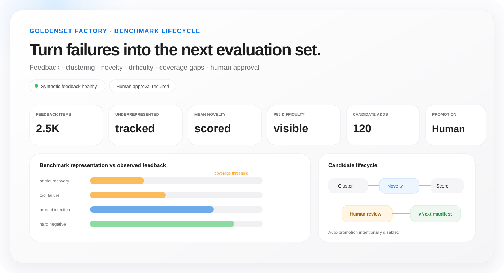
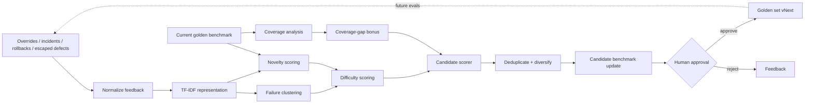

<div align="center">

# GoldenSet Factory

### Turn production failures into the next evaluation set.

**Production-feedback-to-benchmark lifecycle engineering for security and agent evaluations**

`Failure clustering` · `Novelty` · `Difficulty` · `Coverage gaps` · `Deduplication` · `Human approval`\n\n[](https://github.com/VinayK88/GoldenSet-Factory/actions/workflows/ci.yml) [](https://www.python.org/) [](LICENSE)

</div>

<p align="center"></p>

---

## Product thesis

A benchmark becomes stale the moment production starts discovering failure modes that the benchmark does not represent.

GoldenSet Factory focuses on the **data lifecycle behind trustworthy evaluation**:

```text
Production-style feedback
        ↓
Normalize + cluster
        ↓
Novelty + difficulty
        ↓
Coverage-gap analysis
        ↓
Deduplicate + diversify
        ↓
Candidate golden cases
        ↓
Human approval
        ↓
Versioned benchmark vNext
        ↺
```

It does **not** evaluate an agent directly. It builds the machinery that keeps the evaluation set representative of the problems the system is actually encountering.

> **The benchmark is a product with a lifecycle, not a static CSV.**

---

## At a glance

| Layer | What GoldenSet Factory does |
|---|---|
| **Feedback ingestion** | overrides, incidents, rollbacks, escaped defects, customer/service signals |
| **Representation** | TF-IDF text features over normalized failure summaries |
| **Pattern discovery** | KMeans clustering + PCA investigation view |
| **Novelty** | similarity against the current benchmark |
| **Difficulty** | combines novelty, severity, source, and recovery behavior |
| **Coverage** | compares benchmark share vs observed feedback share by failure mode |
| **Selection** | deduplication, diversity floor, coverage-gap bonus, target-size control |
| **Governance** | human approval before benchmark promotion |

The dashboard exposes **30+ benchmark-health, feedback, coverage, novelty, difficulty, and governance KPIs**.

---

## Example: a production failure is missing from the benchmark

Suppose production-style feedback contains a growing cluster of:

```text
failure mode: partial_recovery
source: escaped_defect
severity: high
pattern: agent fixes one step but leaves the workflow in an unsafe partial state
```

The current benchmark contains very few partial-recovery examples. GoldenSet Factory checks representation, novelty, difficulty, and whether the case should be added after human review.

```text
Feedback share:   9.4%
Benchmark share:  2.8%
Coverage ratio:   0.30
Status:           underrepresented

max similarity to existing benchmark = 0.41
novelty score                          = 0.59
```

A high-severity escaped defect with a novel pattern receives stronger priority than a common low-severity duplicate, but **candidate generation never equals automatic promotion**.

---

## Architecture



---

## Dashboard

The Streamlit UI emphasizes benchmark-health evidence, compact governance controls, and executive-to-analyst drill-downs.

KPI families cover feedback volume and source mix, critical/recoverable feedback, current benchmark size, underrepresented/balanced/overrepresented modes, mean/minimum coverage ratio, maximum coverage gap, candidate selection rate, novelty/difficulty distributions, critical candidates, cluster and source diversity, benchmark growth, human approval, and the explicit no-auto-promotion boundary.

---

## Connecting GoldenSet Factory to real data

GoldenSet Factory is built to consume **feedback from systems that already exist**. The synthetic generator can be replaced with incident, review, agent-trace, vulnerability, or service-health records once they are normalized into a compact feedback contract.

### Minimum feedback contract

```text
feedback_id          string
observed_time        timestamp
failure_mode         category
severity             low / medium / high / critical
source               category
summary              text
recoverable          0/1 or boolean
```

Useful optional fields include:

```text
release_id
agent_or_model_version
prompt_version
tool
repo / service / product area
human_override
rollback_id
incident_id
customer_impact
trace_id
```

### Practical data sources

| Source | What becomes benchmark evidence |
|---|---|
| **ServiceNow / Jira / incident DB** | incidents, escaped defects, postmortem failure summaries |
| **GitHub / Azure DevOps** | failed remediation PRs, CI failures, ownership/repo-readiness issues |
| **SARIF / SAST / SCA scanners** | vulnerability findings, remediation outcomes, reopened findings |
| **Agent trace store** | tool-use failures, escalation mistakes, partial recovery, policy violations |
| **Human review system** | overrides, rejected outputs, low-confidence cases, grader disagreements |
| **Deployment platform** | rollback-triggering releases, failed canaries, service-health regressions |
| **Support / customer signals** | validated customer-impact failure patterns after privacy-safe normalization |

For security engineering, SARIF can be particularly useful because it already provides structured rule IDs, severity, locations, and finding metadata. The summary text can be constructed from the rule plus remediation/closure outcome. For agentic systems, traces can be reduced into a privacy-safe failure summary plus tool, workflow stage, policy outcome, and recovery status.

### Normalization example

```python
import pandas as pd
from engine import enrich_candidates, coverage_table

feedback = pd.read_parquet("production_feedback.parquet")
feedback = feedback.rename(columns={
    "id": "feedback_id",
    "failure_category": "failure_mode",
    "description": "summary",
})

# Existing benchmark can come from a versioned CSV/Parquet/DB table.
benchmark = pd.read_parquet("golden_benchmark_v1.parquet")

candidates = enrich_candidates(feedback, benchmark)
coverage = coverage_table(benchmark, feedback)
```

### Connecting an existing benchmark

The current benchmark only needs:

```text
case_id
failure_mode
severity
summary
```

That means the factory can sit beside an existing eval repository rather than forcing a new benchmark format. A production implementation would typically version benchmark snapshots in object storage, Git/LFS, a dataset registry, or a warehouse table and write a manifest for every approved update.

### Recommended production flow

```text
incident / trace / override / rollback systems
                 ↓
privacy-safe normalization
                 ↓
feedback warehouse table
                 ↓
GoldenSet Factory candidate generation
                 ↓
expert review queue
                 ↓
approved cases
                 ↓
versioned benchmark registry
                 ↓
CI / release eval harness
```

The most important integration principle is **provenance**: every benchmark case should retain a source category and version history so teams can explain why it entered the eval set without exposing sensitive production content.

---

## Practical significance

GoldenSet Factory matters because static benchmarks systematically fall behind dynamic production systems. The failures that matter most next quarter may not exist in the benchmark built last quarter.

Practically, it can help teams answer:

- **Which production failure modes are underrepresented in our current eval set?**
- **Are we adding genuinely new cases or merely duplicating common failures?**
- **Are escaped defects and rollbacks feeding back into regression coverage?**
- **Which high-severity failures should become permanent release tests?**
- **Is the benchmark becoming dominated by one high-volume scenario?**
- **Can we explain exactly what changed between benchmark v1.7 and v1.8?**
- **Are release decisions anchored to failures users and engineers are actually observing?**

The practical value is a shorter loop from **production failure → structured evidence → approved benchmark case → future regression protection**.

Without this loop, teams can fix individual incidents but fail to encode the lesson into future release gates. GoldenSet Factory turns that learning into a reusable evaluation asset. Over time, this can reduce repeated escaped defects, improve benchmark representativeness, increase confidence in release-readiness evidence, and make autonomy expansion more governable.

For leadership, the project also creates a measurable benchmark-health story. Instead of saying “we added 100 cases,” the team can report **which coverage gaps were closed, how novel/difficult the additions were, which production sources they came from, and which cases still require expert approval**.

---

## Coverage model

For each failure mode:

```text
coverage_ratio = benchmark_share / feedback_share
```

Reference interpretation:

```text
coverage_ratio < 0.70   → underrepresented
0.70 – 1.45            → balanced
coverage_ratio > 1.45  → overrepresented
```

Underrepresented modes receive a candidate-selection bonus so the next benchmark version closes observed gaps instead of merely adding more examples of already-common failures.

---

## Novelty, difficulty, diversity, and governance

Novelty is calculated as `1 - max_cosine_similarity_to_existing_benchmark`. Difficulty combines novelty, severity, source importance, and recovery difficulty. Candidate generation also includes deduplication and a diversity floor so a single high-volume mode cannot consume the full benchmark budget.

The generated version manifest records the base version, candidate additions, resulting size, failure modes added, source, and the requirement for human approval.

---

## Reproducible benchmark evidence

CI executes the lifecycle runner with a fixed seed on Python 3.10–3.12 and uploads the generated candidate set, coverage table, metrics, and manifest. The manifest includes a deterministic SHA-256 over selected candidate identities and provenance fields.

See [the benchmark protocol](reports/benchmark-protocol.json) and [GitHub Actions](https://github.com/VinayK88/GoldenSet-Factory/actions).

---

## Repository map

```text
.
├── app.py
├── engine.py
├── tests/test_engine.py
├── reports/evaluation.md
├── assets/dashboard-preview.svg
├── .streamlit/config.toml
├── .github/workflows/ci.yml
├── Dockerfile
└── requirements.txt
```

---

## Run locally

```bash
pip install -e '.[dev]'
python engine.py --out artifacts --feedback 2500 --target 120
streamlit run app.py
```

The CLI writes `coverage.csv`, `candidate_cases.csv`, `manifest.json`, and `metrics.json` under `artifacts/`.

---

## What this project is demonstrating

GoldenSet Factory shows thinking across benchmark lifecycle engineering, production feedback loops, representative dataset construction, text feature engineering, clustering, novelty detection, coverage measurement, deduplication, versioned evaluation assets, provenance, and human-in-the-loop governance.

---

## Responsible interpretation

All feedback, incidents, rollbacks, escaped defects, and benchmark cases are **synthetic** in the repository. Clustering, novelty, difficulty, and coverage scores are triage mechanisms—not substitutes for expert benchmark review. Auto-promotion is intentionally disabled.

<div align="center">

### Production failure becomes benchmark evidence—only after review.

</div>
